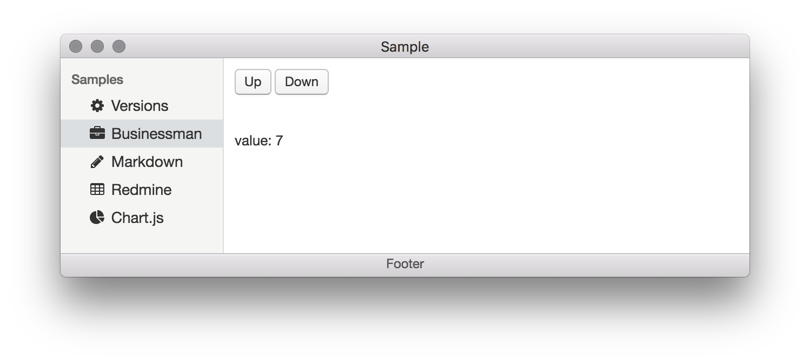
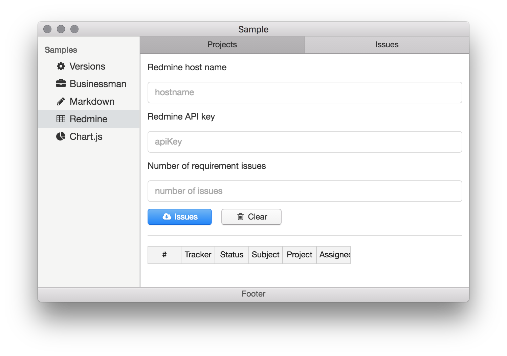
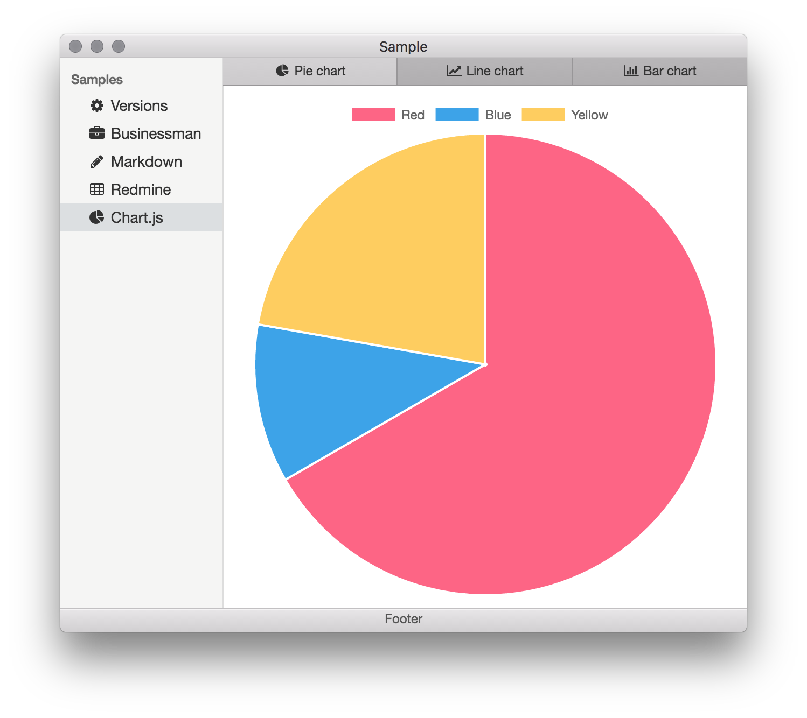

# これは何？

Electron + Riot.js (ES2015) のサンプルコードです。

# コンテンツ

以下のサンプルを実装しています。

* Versions
* Businessman
* Markdown
* Redmine
* Chart.js

また、全体的に、[Photon](http://photonkit.com/) を使用してUIを構築しています。

## Versions


* node、chrome、electron のバージョンを表示します。
* Electron Quick Start と同じです。

## Businessman



* [Up] [Down] ボタンを押すと値がインクリメント/デクリメントするだけのサンプルです。
* 値の管理に、Reduxライクな状態管理ライブラリ [Businessman](https://gitlab.com/aggre/businessman) を使用しています。

## Markdown


* 2ペインのMarkdownエディタのサンプルです。
* emacs キーバインドです。
* `:hoge:` で、UNICODE絵文字と font-awesome を認識します。
* エディタに [ace](https://ace.c9.io) を、Markdownパーサに [markdown-it](https://github.com/markdown-it/markdown-it) を使用しています。

## Redmine



* Redmineからチケットを取得し、一覧するサンプルです。
* Redmine REST API の処理に [node-redmine](https://github.com/zanran/node-redmine) を、テーブルに [Handsontable](https://handsontable.com/) を使用しています。

## Chart.js



* Pie chart、Line chart、Bar chart を表示するサンプルです。
* グラフの描画に [Chart.js](http://www.chartjs.org/) を使用しています。

# Getting started

## 要求する環境

* node.js

以下のバージョンで動作確認しています。

```sh
$ node -V
v6.9.4
$ npm -v
3.10.10
```

## インストール

```sh
$ git clone https://github.com/taturou/electron_sample_riot.git
```

## ビルド

```sh
$ npm install
$ npm run build
```

## 実行

```sh
$ npm start
```

## パッケージング

```sh
$ npm run package-win
$ npm run package-mac
```

# ファイル構成

## 概要

`git clone` すると以下のフォルダが存在します。

<pre>
electron_sample_riot
├── .vscode/            - Visual Studio Code 用の設定ファイルを格納しています。
├── gulp/               - gulp タスクをタスクごとにファイルに分けて格納しています。
├── readme/             - このファイル用の画像を格納します。
├── src/                - ソースです。html も js も全てここに格納しています。
├── .babelrc            - js は ES6 で書いてバベります。
├── .editorconfig       - EditorConfig 用の設定ファイルです。
├── .gitignore          - .gitignore です。
├── LICENSE             - 意味もなくMITライセンスです。
├── README.md           - このファイルです。
├── gulpfile.babel.js   - gulp。ES6 で書いてます。
└── package.json        - package.json
</pre>

以下のフォルダは動的に生成されます。

<pre>
electron_sample_riot
├── dist/               - src/ をビルドした成果物を格納します。このファイルだけあればアプリが動きます。
├── node_modules/       - npm モジュールです。
├── release/            - dist/ をパッケージングしたものを格納します。
└── tmp/                - src/ から dist/ を作るときに出る一時ファイルを格納しています。
</pre>

## src/

npm ライブラリ以外のソースコードは、全て src/ で管理しています。

<pre>
electron_sample_riot
└── src/
     ├── main/                                - Electron のメインスレッドで動作するコードを置きます。
     │   └── js/
     │       └── main.js                     - Electron のエントリです。
     └── render/                              - Electron のレンダースレッドで動作するコードを置きます。
         ├── html/
         │   └── index.html                  - index.html です。main.js から loadURL() されます。
         ├── js/
         │   ├── businessman/                - businessman の Worker です。
         │   │   ├── businessman.js
         │   │   ├── index.js               - 他の js を import して、worker.start() します。
         │   │   ├── markdown.js
         │   │   └── redmine.js
         │   └── main.js                     - このアプリのメイン処理です。index.html から読み込まれます。
         └── tags/                            - Riot.js のタグファイルです。
             ├── app.tag.html                 - メインウィンドウです。各コンテンツを切り替えます。
             ├── businessman/                 - Businessman 用です。
             │   └── index.tag.html
             ├── chartjs/                     - Chart.js 用です。
             │   ├── chart_bar.tag.html
             │   ├── chart_line.tag.html
             │   ├── chart_pie.tag.html
             │   └── index.tag.html          - index がタグを切り替えます。
             ├── markdown/                    - Markdown 用です。
             │   ├── editor.tag.html
             │   ├── index.tag.html
             │   └── viewer.tag.html
             ├── redmine/                     - Redmine 用です。
             │   ├── index.tag.html
             │   ├── issues.tag.html
             │   └── projects.tag.html
             ├── util/                        - 各コンテンツで共通して使用するタグです。
             │   ├── fontawesome.tag.html
             │   └── notification.tag.html
             └── versions/                    - Versions 用です。
                 └── index.tag.html
</pre>

## dist/

src/ から生成したコードは dist/ に格納されます。

基本的に js はバンドルして一ファイルになりますが、font や css などは node_modules/ 以下から動的に読み込みます。

そのための dist/package.json は package.json から生成します。
アプリの実行に必要なモジュールは 'dependencies' に定義されているので、'scripts' と 'devDependencies' を除いたものをコピーします。

npm モジュールのインストールは、ビルド時に [gulp-install](https://github.com/slushjs/gulp-install) を用いて行います。

<pre>
electron_sample_riot
└── dist/
     ├── main/                      - src/main/ から生成したソースコードを格納しています。
     │   └── js/
     │       └── main.js
     ├── node_modules/              - アプリの実行に必要なだけの npm モジュールを格納しています。
     ├── package.json               - package.json から生成します。
     └── render/                    - src/render/ から生成したソースコードを格納しています。
         ├── html/
         │   └── index.html
         └── js/
             ├── bundle.js          - src/render/js/**/*.js と src/render/tags/**/*.tag.html を browserify でバンドルしたものです。
             ├── bundle.js.map      - ソースマップです。パッケージングするときは除かれます。
             └── businessman/
                 ├── worker.js      - src/render/js/businessman/*.js を browserify でバンドルしたのもです。
                 └── worker.js.map
</pre>

# npm run xxx

### build

```sh
$ npm run build
```

src/ から dist/ を生成します。

dist/node_modules/ も自動的にインストールします。

### start

```sh
$ npm start
```

dist/ から Electron を起動します。

### clean

```sh
$ npm run clean
```

tmp/ と dist/ を削除します。

### package

```sh
$ npm run package-mac
$ npm run package-win
```

dist/ をパッケージングします。

自動的に `npm run build` を実行します。

### watch

```sh
$ npm run watch
```

ソースコードの修正を監視し、自動的にビルドします。

### serve

```sh
$ npm run serve
```

dist/ から Electron を起動します。

ソースコードの修正を監視し、修正があれば自動的にコードをリロードします。
メインスレッドとレンダースレッドの両方に対応しています。

### debug

```sh
$ npm run debug
```

`npm run watch` と `npm run serve` を同時に実行します。

### gulp

```sh
$ npm run gulp hoge
```

gulp タスク 'hoge' を直接実行します。

### help

```sh
$ npm run help
```

gulp タスクの一覧を表示します。
